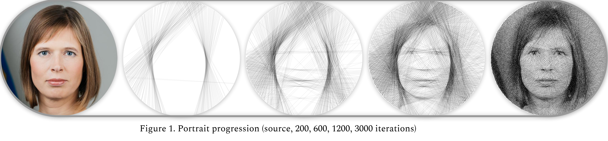
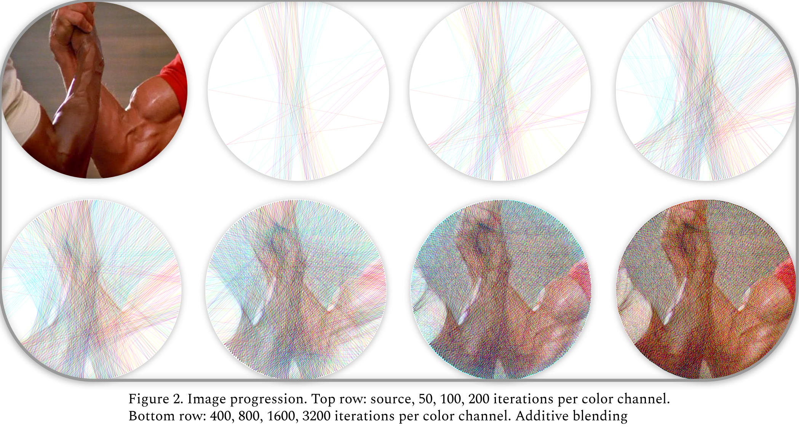
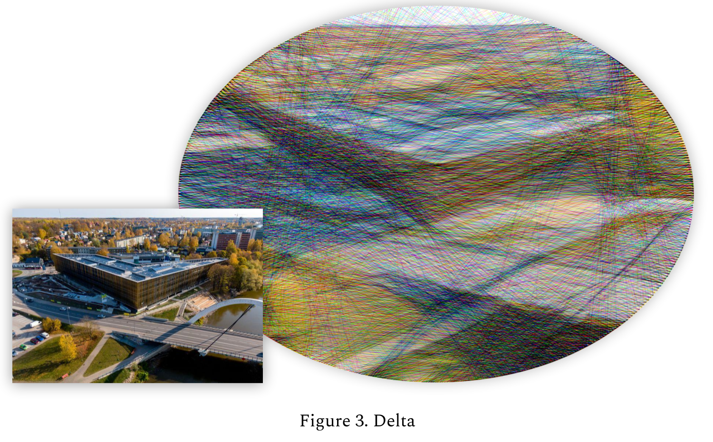
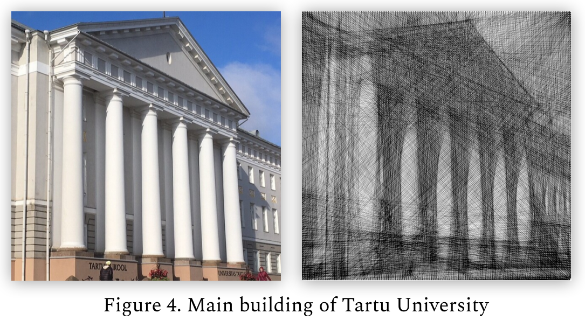

# String Art

Generate artwork by connecting nails with strings.

Modified from [repo](https://github.com/kaspar98/StringArt)

<details>
Project for algorithmics course 2020. Also submitted  to DeltaX 2021. 

For a quick overview of the project, look at the project's [poster](assets/Poster.pdf).
</details>

## Project

- Generate `artwork` (and step-by-step `guideline`) by hooking a continuous string around nails. 

- The nails are fixed on the border of a canvas (e.g. `circle` or `rectangle`).

## I/O

- **Input**: 
    - canvas shape, 
    - reference image.

- **Output**: 
    - string-art version of the reference image, 
    - guideline to reproduce. 

## Algorithm

1. Evaluate the `quality` of every possible `string pull` from the current nail.¹
2. Pull the string to the best found nail.
3. Set the new nail as the current nail.
4. Repeat the algorithm.²

**Notes:**
- ¹ To evaluate the `quality` of a `string pull`, measure the distance (*squared difference*) of the 2 pixels. The best `string pull` is the line that cumulates the most in reproducing the input.

- *² The `number of iterations` can be set manually. If not, the algorithm will repeat until it fails to find any `string pull` that improve the final result.

## Usage
```shell
python generate.py -i <input.png> -o <output.png>
```

Arguments:
* `-d <int>` output file dimensions (default is 300); if output dim are scaled up, then string strength should be scaled correspondingly;
* `-l <int>` number of iterations (default will run until no improvement);
* `-r <int>` number of random nails to pick from when choosing the next nail (default looks at all possible nails every iteration, good value for this is ~50). **Note:** speed up the algorithm at the cost of quality;
* `-n <int>` step between nails (default is 4). The smaller the step, the more nails there will be. The larger the step, the less nails. Minimum possible value is 1;
* `-s <float>` string strength for output (default is 0.1);
* `--rgb` for colored output (default is black string on white canvas). In case of RGB, pull order isn't returned as it might not match the real life result (additive blending);
* `--wb` for white string on a black canvas;
* `--rect` to put nails in a square around the picture (default is circle).

Nails are placed evenly around the perimeter. 
- For circles the first nail is placed at `9 o'clock` and the order goes `clockwise`. 
- For squares, the first nail is placed at the `top left corner` and the order goes `clockwise`.

# Examples

--------

--------

--------

